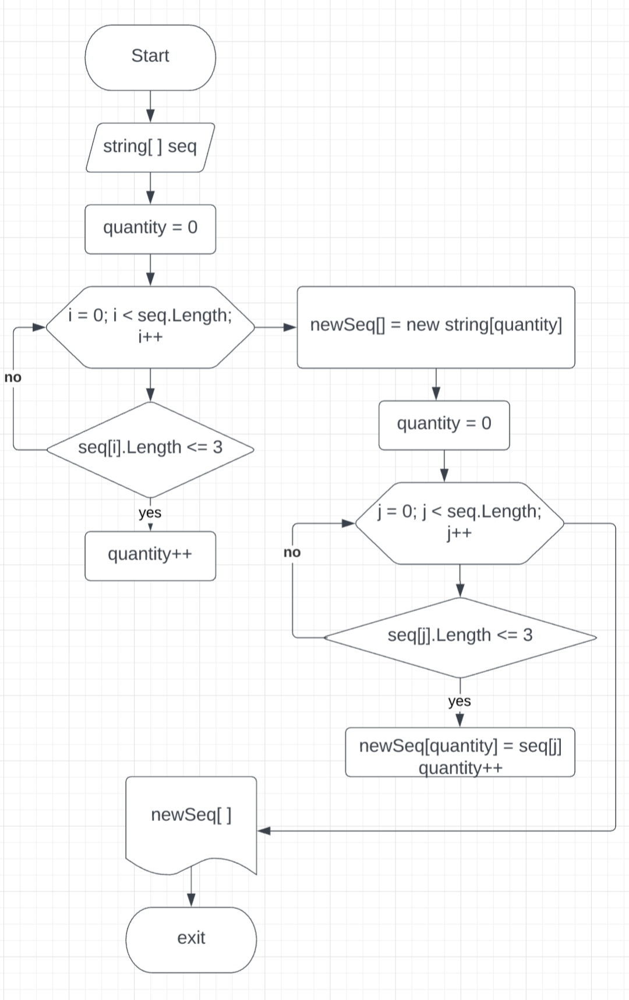

# Текстовое описание решения к итоговой проверочной работе.

## Описание работы метода *Sequence*:
* Инициализируется модуль *Sequence*, принемающий массив строк **string[ ] seq{}**
* Задаем переменную **quantity** и присваиваем ей значение "НОЛЬ". В этой переменной будит храниться колличество значений, удовлетворяющих условию.
* Итерируем массив по индексу __i__ от 0 до конца массива
    * Определяем размер строки и если размер строки меньше или равен 3, увеличиваем на 1 значение переменной *quantity*. Таким образом мы узнаем колличество совпадений, удовлетворяющих условию задачи.
* По окончании итерации мы узнали какого размера должен быть новый массив. Создаем новый массив нужного размера.
* Обнуляем переменную **quantity**.
* Снова итерируем массив строк.
    * Если размер строки меньше или равен 3
        * Присваиваем элементу нового списка, индекс, которого равен значению переменной **quantity**
        * Увеличиваем на 1 значение переменной **quantity** тем самым перемещаемся по индексам второго массива.
* По окончании работы второго итератора все искомы значения помещены в новый массив строк. Метод возвращает новый массив строк искомых значений.
* Конец метода.